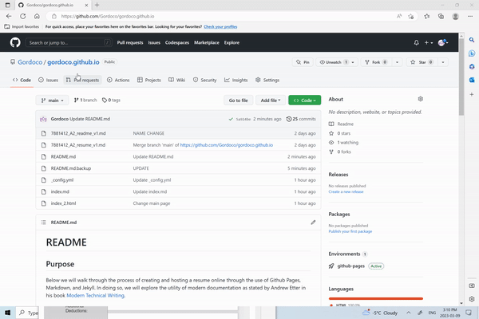

# README

## Purpose
Below we will walk through the process of creating and hosting a resume online through the use of Github Pages, Markdown, and Jekyll like the gif above. In doing so, we will explore the utility of modern documentation as stated by Andrew Etter in his book [Modern Technical Writing][Etter's Book].

## Prerequisites
These instructions assume you have created/understood the following:
  
- A Github account (create an account [here][Github])
- A resume formatted in Markdown (Markdown syntax [here][MarkdownGuide], Resume guide [here][ResumeGuide])

## Instructions
### Setup the repository:
1. Log into your Github account and navigate to the home page (should be the default page after logging in).
2. Click on the **New** button in the top left of the screen to create a new repository
3. Name the repository _**username**_.github.io
	+ _**username**_ should match the name on your Github account.
	+ In his book, Etter says to use distributed version control. This is the purpose of hosting your resume through a repository. Now you can collaborate and keep track of changes to your resume automatically without the fear of losing data. 
4. Make your repository **Public**
	- The repository should be Public by default, but this is essential for ensuring your website is accessable.
5. Click _Add a README file_
	- A _README_ file allows other collaborators to know the purpose/function of the repository.
6. Click **Create Repository**

### Uploading our Resume:
1. Open your newly created repository
2. Click the _**Add File**_ button
3. Click the _**Upload Files**_ button
	- This will open a dialogue window to upload your resume.md file that you created before.
	- We are using a Markdown file because lightweight markup languages allow for the abstraction of intense and complex languages such as XML and JavaScript. Etter emphasizes this in his book.
4. Click the _**Commit changes**_ button to submit your files

### Configuring your Site:
4. Rename your resume.md to index.md
	- This allows Github to recognize your resume
 as the root page for your website.
 	- If you go to https://_**username**_.github.io you should see your resume (after Github has a chance to build and deploy your changes).
5. Click the _**Commit changes**_ button again to update your file

### Formatting and Theme:
1. Click the _**Add File**_ button
2. Click the _**Create new file**_ button
	- This will open a web editor for our file
3. Name your file _**_config.yml**_
	- This file will specify the style and format of your site, this separates the design and content of your website.
	- Etter emphasizes the need to not duplicate work. This config file allows us to create an abstraction that will limit duplication.
	- In addition, the way Github creates your site is through a software called Jekyll which creates a static site from the markdown file for your resume, and the style information contained in the _**_config.yml**_ file. This is the power of a static site that Etter talks about in his book!
4. In the file add the following lines:
	>remote-theme: _**creator/theme-name**_
	-	This is your theme for your website, Github in the background will import the style information from the specified theme.
	-	You can find a list of potential themes that are publicly available [here][ThemePages].
	-	Always make sure to give credit to the theme's creator in your README!
5. Click the _**Commit new file**_ button to save and push your file to the repository.
	- As before, after a short delay for Github to build and deploy your site again, going to https://_**username**_.github.io should show your newly formatted resume (see gif above for example).

## Authors and Acknowledgements
- Author:
	- Cody Gordon
- Theme Author:
	- [coogie][ThemeAuthor]
- Acknowledgments:
	- Special thanks to my group-mates Hong Gao, Rolf Olayan, and VICTOR IFEAKACHI EZENDU for their assistance and advice. 

## FAQs
1. Why use Markdown instead of a Word Processor?
	- Markdown is a lightweight scriptable language that is designed to be compatible with the web. This provides increased flexibility and power over a traditional Word Processor such as Microsoft Word.
	
2. Why is my resume not showing up?
	- Github takes time to deploy your website after a new commit, from your repository page if you navigate to the _**Actions**_ tab you can see if there is an active process (orange) or a failed process (red) which could be causing the problems. See [here][Github Pages Troubleshooting] if your site is failing repeatedly.

[Etter's Book]: https://www.amazon.ca/Modern-Technical-Writing-Introduction-Documentation-ebook/dp/B01A2QL9SS
[Github]: https://www.github.com
[ResumeGuide]: https://zety.com/blog/how-to-make-a-resume
[MarkdownGuide]: https://www.markdownguide.org/basic-syntax/
[ThemePages]: https://github.com/planetjekyll/awesome-jekyll-themes
[ThemeAuthor]: https://github.com/coogie/oscailte
[Github Pages Troubleshooting]: https://docs.github.com/en/pages/setting-up-a-github-pages-site-with-jekyll/about-jekyll-build-errors-for-github-pages-sites